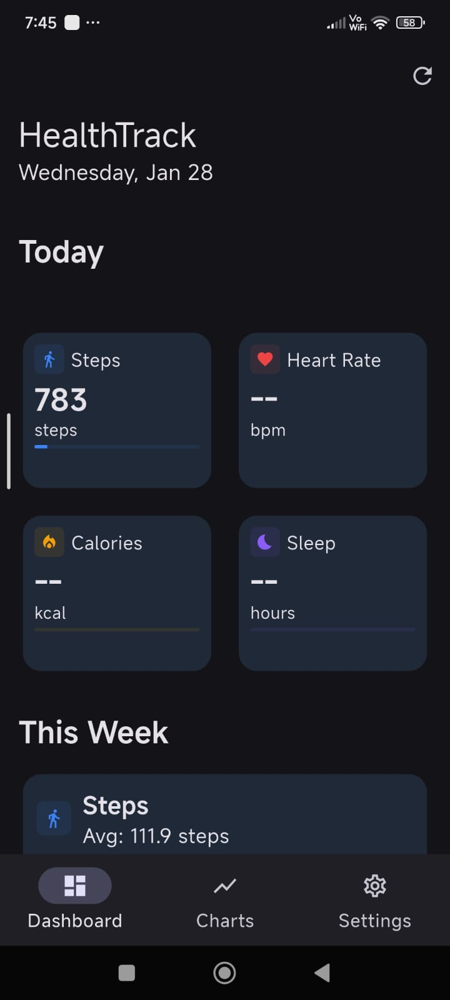
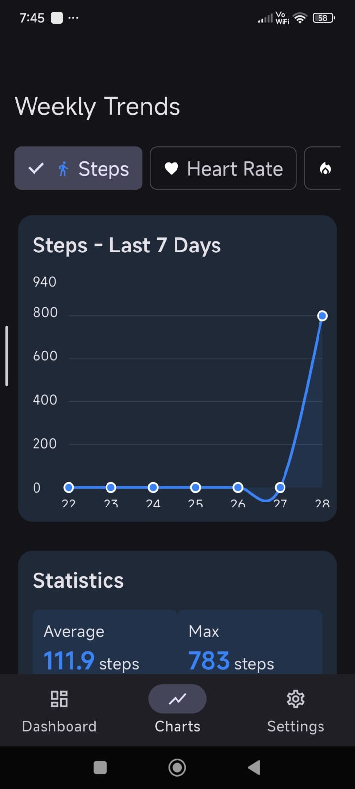

# 🏃‍♂️ HealthTrack - Your Personal Health Companion

<div align="center">


**Track your health metrics and visualize your progress over time**

[](https://flutter.dev)
[](https://www.apple.com/ios)
[](https://www.android.com)
[](LICENSE)

</div>

---

## 🚀 Features

* **Health Metrics Tracking**: Steps, heart rate, calories burned, and sleep duration
* **Charts & Statistics**: Line charts with 7-day trends
* **Customizable Settings**: Toggle individual health metrics on/off
* **Theme Support**: Light and dark themes with system preference detection
* **Permission Management**: Granular health data permission requests

---
## 📸 Screenshots & Demo

<div align="center">

### 🏠 Dashboard




### 📊 Trends



### ⚙️ Preferences


</div>

---

## 🎥 Demo Video

> Full app walkthrough and core features demonstration

[▶️ Watch Demo Video](screenshots/demo.mp4)

## 🏗 Architecture

### Project Structure

```
lib/
├── core/
│   ├── theme/
│   │   └── app_theme.dart          # Material 3 theme configuration
│   ├── models/
│   │   ├── health_data_type.dart   # Health metric definitions
│   │   └── health_metric.dart      # Data models
│   └── utils/
│       └── date_utils.dart         # Date formatting utilities
├── services/
│   └── health_service.dart         # Health data abstraction layer
├── features/
│   ├── permissions/
│   │   └── permissions_screen.dart # Onboarding & permissions
│   ├── dashboard/
│   │   ├── dashboard_screen.dart   # Main dashboard
│   │   └── widgets/
│   │       ├── metric_card.dart    # Individual metric display
│   │       └── weekly_summary_card.dart
│   ├── charts/
│   │   └── charts_screen.dart      # Weekly trend charts
│   └── settings/
│       └── settings_screen.dart    # App settings
└── main.dart                       # App entry point
```

### Architecture Decisions

1. **Feature-Based Organization**: Code is organized by feature rather than layer for maintainability and scalability.
2. **Service Abstraction**: `HealthService` abstracts all platform interactions, providing a clean API for UI components.
3. **Simple State Management**: Uses `setState` for local state management, avoiding unnecessary complexity for MVP.
4. **Reusable Widgets**: Widgets like `MetricCard` and `WeeklySummaryCard` promote code reuse.
5. **Material 3 Design**: Leverages Flutter's Material Design 3 components for a polished look.

---

## 📊 Supported Health Data

| Metric          | Android (Google Fit) | iOS (HealthKit) | Unit  |
| --------------- | -------------------- | --------------- | ----- |
| Steps           | ✅                    | ✅               | steps |
| Heart Rate      | ✅                    | ✅               | bpm   |
| Calories Burned | ✅                    | ✅               | kcal  |
| Sleep Duration  | ✅                    | ✅               | hours |

---

## ⚡ Setup & Installation

### Prerequisites

* Flutter SDK (3.10.7 or higher)
* Dart SDK
* Android Studio / Xcode for platform-specific builds

### Dependencies

```yaml
dependencies:
  health: ^11.0.0              # Health data integration
  fl_chart: ^0.69.0            # Chart visualization
  intl: ^0.19.0                # Date formatting
  permission_handler: ^11.3.1  # Permission management
```

### Installation Steps

1. Clone the repository:

   ```bash
   git clone https://github.com/USERNAME/REPO_NAME.git
   cd REPO_NAME
   ```

2. Install dependencies:

   ```bash
   flutter pub get
   ```

3. **Android Setup**:

   * Add required permissions to `android/app/src/main/AndroidManifest.xml`
   * Configure Google Fit API in Google Cloud Console
   * Add OAuth client ID

4. **iOS Setup**:

   * Enable HealthKit capability in Xcode
   * Add usage descriptions to `Info.plist`

5. Run the app:

   ```bash
   flutter run
   ```

---

## 📱 Platform-Specific Configuration

### Android (Google Fit)

Add to `AndroidManifest.xml`:

```xml
<uses-permission android:name="android.permission.ACTIVITY_RECOGNITION"/>
<uses-permission android:name="android.permission.health.READ_STEPS"/>
<uses-permission android:name="android.permission.health.READ_HEART_RATE"/>
```

### iOS (HealthKit)

Add to `Info.plist`:

```xml
<key>NSHealthShareUsageDescription</key>
<string>This app needs access to your health data to display your fitness metrics</string>
<key>NSHealthUpdateUsageDescription</key>
<string>This app needs to update your health data</string>
```

---

## ⚠️ Known Limitations

1. Google Fit API deprecation; future Android versions should migrate to Health Connect
2. Read-only implementation; writing data is not implemented
3. Data visualization limited to last 7 days
4. No backend; all data is device-local
5. Limited metrics (currently 4 core metrics)
6. Permission handling may require extra configuration per platform

---

## 🔮 Future Enhancements

* Migration to Health Connect for Android
* Extended date range selection
* Data export functionality
* Goal setting and achievement tracking
* Notifications and reminders
* More health metrics (water intake, weight, etc.)
* Data insights and trends analysis

---

## 📌 Technical Notes

* Minimum SDK: Android 8.0 (API 26), iOS 12.0
* State Management: `setState` for MVP scope
* Error Handling: Graceful degradation when permissions are denied or data unavailable
* Performance: Efficient date-based queries
* UI/UX: Material 3 design with smooth animations and transitions

---

